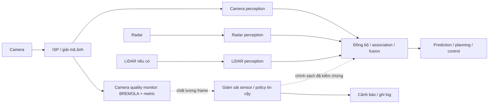

# Vị trí bài T1 trong pipeline ADAS

## Bài toán đã chốt

Đánh giá độ sắc nét của frame camera ADAS sau khi có ảnh đã qua ISP/giải mã, tạo tín hiệu chất lượng để hỗ trợ giám sát camera và quyết định mức tin cậy của nhánh camera trong hệ thống perception/fusion.

BREMOLA nhận ảnh và trả score không cần ảnh tham chiếu. Không nhận radar/LiDAR raw, không hợp nhất sensor và không sửa ảnh bị mờ. Score không phải detector confidence hoặc xác suất camera hoạt động tốt.

## Kiến trúc tích hợp đề xuất

Đây là thiết kế đề xuất, không phải kiến trúc VinFast đã được xác minh. Các nhánh sensor xử lý dữ liệu riêng và được đồng bộ khi fusion; không cần diễn đạt thành thứ tự radar rồi LiDAR rồi camera. Quality monitor có thể chạy song song camera perception và cung cấp thông tin cho policy, thay vì bắt detector chờ score mỗi frame.

## Cơ sở nguồn

- NVIDIA mô tả pipeline Pony.ai, Figure 9: cùng CameraFrame được gửi tới perception, localization, recorder và camera quality monitor. Điều này hỗ trợ vị trí monitor ở nhánh xử lý ảnh sau thu nhận: https://developer.nvidia.com/blog/accelerating-the-pony-av-sensor-data-processing-pipeline/
- NVIDIA DRIVE Labs trình bày camera–radar fusion, có xử lý trường nhìn và đồng bộ tần suất sensor: https://developer.nvidia.com/blog/drive-labs-covering-every-angle-with-surround-camera-radar-fusion/

Các nguồn trên hỗ trợ mô hình pipeline tổng quát; việc dùng BREMOLA để điều chỉnh policy của fusion là đề xuất của nhóm, chưa được các phép thử trong lab xác nhận. Không kết luận mẫu xe VinFast cụ thể có LiDAR khi chưa có tài liệu đúng model/phiên bản xe.

## Input, output và nơi sử dụng

| Thành phần | Nội dung |
|---|---|
| Input triển khai | Frame camera sau ISP, camera_id, frame_id và timestamp |
| Output đề xuất | Score BREMOLA, các metric hỗ trợ, valid/invalid, gắn cùng camera_id/frame_id/timestamp |
| Nơi sử dụng | Sensor supervisor để ghi log/cảnh báo; policy fusion để xem xét độ tin cậy nhánh camera |
| Điều cần hiệu chuẩn | Ngưỡng theo camera, độ phân giải và điều kiện; không lấy score/100 làm trọng số fusion |
| Điều kiện tích hợp | Score phải khớp frame/timestamp; đo latency và xử lý score thiếu/trễ; chỉ fallback khi sensor khác đủ điều kiện |

Schema gắn timestamp và policy trên chưa được triển khai trong script hiện tại. Không tự giảm trọng số nhánh camera chỉ vì một frame có score thấp; cần kiểm chứng false alarm, scene dependence và ảnh hưởng downstream.

## Ranh giới benchmark hiện tại

Đã thực hiện: 50 ảnh đường phố → resize cố định → average blur → tính score → CSV/plot và failure case. Đây là kiểm thử offline của block quality monitor.

Chưa thực hiện: camera thật/ISP thật, chuỗi video online, radar/LiDAR, detector, time synchronization, fusion, policy hoặc điều khiển xe. Không suy ra chất lượng toàn hệ thống từ kết quả offline.

Kết quả bám câu hỏi: score phản ứng thế nào khi blur tăng; complexity compensation có giảm độ phân tán giữa các ảnh không; có trường hợp xếp thứ tự blur sai không?

Giới hạn quan trọng: subset clear/daytime không đủ kiểm chứng dao động giữa night/day hoặc chuyển cảnh. 21/50 ảnh có ít nhất một bước BREMOLA tăng khi blur tăng, nên không dùng metric này một mình để ra quyết định hỏng sensor.

## Câu nói khi trình bày

“Nhóm làm block camera quality monitor, đặt sau khi thu nhận/ISP và chạy song song perception. Block trả score gắn với frame; sensor supervisor có thể dùng để cảnh báo và hỗ trợ policy tin cậy của fusion camera–radar/LiDAR. Lab hiện chỉ kiểm thử block score bằng blur mô phỏng, chưa triển khai fusion hay đo cải thiện detector.”
