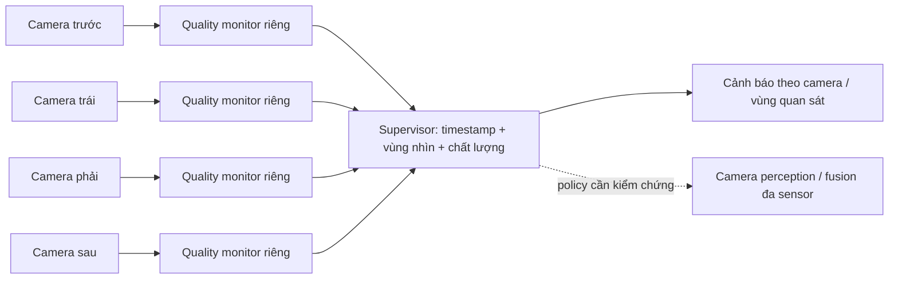

# Hướng mở rộng: chất lượng quan sát của hệ nhiều camera

Trạng thái: thiết kế đề xuất, chưa có benchmark nhiều camera đồng bộ. Kết quả 50 ảnh hiện tại vẫn là benchmark metric trên các ảnh riêng.

## Bài toán

Sau khi tính chất lượng từng camera, hệ thống cần xác định camera/vùng nhìn nào đang suy giảm và liệu vùng quan sát phục vụ một tính năng ADAS còn đủ dữ liệu camera đáng tin hay không.

Tên nên dùng: “Giám sát chất lượng từng camera và độ phủ quan sát của hệ nhiều camera”. Không gọi score này là confidence nhận diện hoặc độ chính xác fusion, vì chưa được hiệu chuẩn hay đánh giá bằng detector/ground truth.

## Pipeline đề xuất

## Không lấy trung bình score thô làm kết luận duy nhất

Bốn camera có thể nhìn các cảnh, độ phân giải và exposure khác nhau. Score thô không mặc nhiên có cùng ý nghĩa. Ngay cả sau hiệu chuẩn, trung bình có thể che mất camera quan trọng: nếu các quality index giả định là 0,2; 0,9; 0,9; 0,9 thì trung bình 0,725 vẫn che một camera có index thấp. Đây là ví dụ giả định, không phải kết quả thực nghiệm hoặc xác suất camera khỏe.

Ưu tiên lưu vector chất lượng theo camera, trạng thái missing/stale/invalid và vùng nhìn bị ảnh hưởng. Hiệu chuẩn ngưỡng từng camera trên tập riêng trước khi chuyển score thành trạng thái cảnh báo. Nếu chỉ đưa một score tổng, phải giữ kèm trạng thái từng camera và vùng quan sát quan trọng.

## Tín hiệu tổng hợp có thể thử

| Tín hiệu | Mục đích | Giới hạn |
|---|---|---|
| Danh sách camera dưới ngưỡng đã hiệu chuẩn | Xác định nhánh cần kiểm tra | Cần đo false alarm khi đổi cảnh/noise |
| Chất lượng thấp nhất trong nhóm camera quan trọng cho tính năng | Tránh trung bình che lỗi camera trước | Có thể quá bảo thủ nếu camera khác thực sự phủ đủ vùng |
| Độ phủ vùng có ít nhất một camera hợp lệ, còn đủ chất lượng | Phản ánh vùng quan sát bị mất | Cần calibration, field of view và xử lý occlusion; không chỉ đếm camera |

Độ phủ quan sát không đồng nghĩa phát hiện đúng vật thể. Radar/LiDAR có thể hỗ trợ nhưng không mặc định thay thế được mọi thông tin của camera. Không dùng BREMOLA/100 trực tiếp làm trọng số fusion.

## Phép thử tiếp theo

1. Có frame nhiều camera cùng timestamp hoặc tolerance đã khai báo, kèm camera_id và vùng nhìn/calibration. Không coi năm ảnh BDD100K độc lập là năm camera thật.
2. Baseline giữ nguyên cả bộ frame; tạo blur riêng một camera ở 3–5 mức. Sau đó thêm trường hợp hai camera cùng suy giảm.
3. Tính score theo camera bằng pipeline cố định. Hiệu chuẩn ngưỡng trên dữ liệu riêng; test trên scene khác. Camera mất frame cần trạng thái riêng, không coi score thiếu là bình thường.
4. Đo false alarm trên camera chưa chủ động gây lỗi, tỷ lệ phát hiện camera đã blur, vùng nhìn bị ảnh hưởng và latency của monitor. Đây là metric phát hiện corruption mô phỏng, không phải fault vật lý.
5. Chỉ đánh giá khả năng perception/fusion khi có detector/fusion và ground truth: so baseline, lỗi không policy và lỗi có policy; đo recall/false positive theo vùng/vật thể. Chưa triển khai bước này.

## Phạm vi cho lab hiện tại

Giữ benchmark T1 đã hoàn thành. Hướng multi-camera là phần extension/engineering decision; không thay nhãn kết quả 50 ảnh thành thử nghiệm hệ nhiều camera. Kiểm chứng metric từng camera là điều kiện cần, chưa đủ để chứng minh sensor-fusion reliability.

## Nguồn hỗ trợ kiến trúc

[NVIDIA DRIVE Labs: Surround Camera-Radar Fusion](https://developer.nvidia.com/blog/drive-labs-covering-every-angle-with-surround-camera-radar-fusion/) mô tả fusion trên các nhánh perception camera/radar, xử lý vùng nhìn và đồng bộ tần suất. Bài này hỗ trợ bối cảnh nhiều camera; bộ tổng hợp chất lượng và policy ở trên là đề xuất của nhóm, không phải thuật toán BREMOLA gốc hoặc kết quả NVIDIA đã chứng minh.
