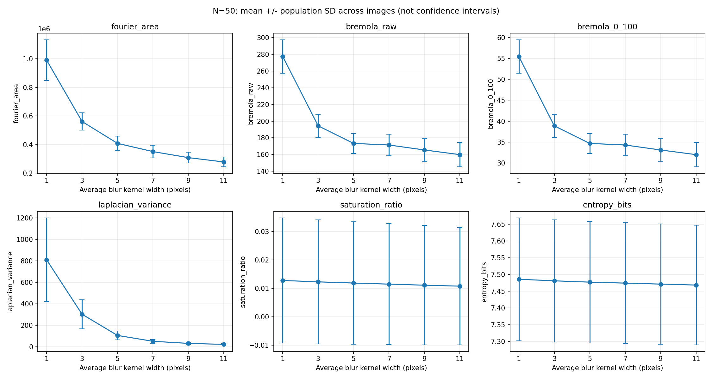
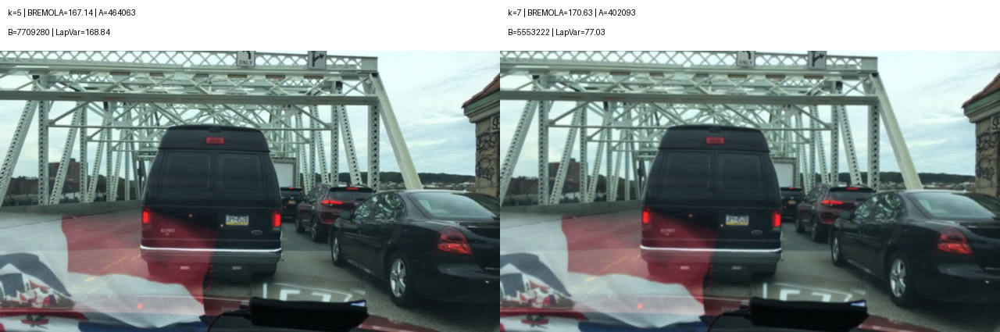

# Báo cáo cá nhân — Phạm Văn Kiên

- MSSV: 2A202602590
- Repository: https://github.com/vukhai248/K4-Track4-Day04-vadora-Sensor-Reality-Sprint
- Nội dung kỹ thuật bên dưới dựa trên benchmark chung của nhóm, được chuẩn bị với hỗ trợ của Codex.
- Phần phụ trách theo phân công: Phụ trách rà soát bảng/plot, failure case, limitation và đề xuất engineering decision; trình bày failure–decision.
- Phân công trên không phải xác nhận mọi việc đã được cá nhân tự thực hiện; thành viên cần kiểm tra và trình bày phần mình phụ trách.

## 1. Problem

Camera ADAS có thể vẫn xuất ảnh nhưng ảnh suy giảm độ sắc nét. Nhóm kiểm tra lỗi blur bằng mô phỏng average blur trên cùng ảnh đường phố. Claim ban đầu: khi mức blur tăng, score độ sắc nét dự kiến giảm; việc bù complexity có thể giảm độ phân tán score giữa các cảnh.

Mục tiêu là đo phản ứng của metric, không xác định camera hỏng vật lý hay chứng minh độ chính xác detector. Không có training hoặc inference detector trong phép thử.

Vị trí tích hợp đề xuất: sau thu nhận ảnh/ISP, camera quality monitor chạy song song camera perception; score gắn frame/timestamp gửi tới sensor supervisor để ghi log/cảnh báo và hỗ trợ policy tin cậy trước fusion. Radar/LiDAR có nhánh perception riêng; không phải pipeline nối tiếp radar rồi camera. Đây là kiến trúc đề xuất, không phải hệ thống VinFast được xác minh. Xem [pipeline và nguồn tham khảo](../docs/ADAS_PIPELINE.md). Benchmark hiện tại chỉ kiểm thử offline block score, chưa chạy ISP thật, supervisor hoặc fusion.

## 2. Method

Nguồn: Nam, Youn, Ha (2025), [BREMOLA, Vehicles 7(1), 8](https://www.mdpi.com/2624-8921/7/1/8), DOI 10.3390/vehicles7010008; [code công khai, commit 7ba26999](https://github.com/woongchan789/BREMOLA/blob/7ba26999c265692bb8e44c5a3f2d91c06746830f/bremola.py).

Input là một ảnh; output là score. Không cần ảnh tham chiếu để tính từng score. Score Fourier A là số phần tử vượt ngưỡng 100 của phổ `14*log(1+abs(FFT shifted))`; B là tổng giá trị Laplacian `CV_8U`, kernel size 3. BREMOLA raw = A/sqrt(B); code công khai chia thêm 5 và clip về 0–100. Nếu B=0, script đánh dấu invalid thay vì chia cho 0.

Paper đề xuất bù độ phức tạp cảnh nhằm giảm biến động score theo nội dung và báo cáo kết quả trên 45 frame × 20 mức blur. Đó là kết quả của tác giả. Nhóm áp dụng các phép tính trong code công khai trên dữ liệu riêng; kernel/padding theo OpenCV, không tuyên bố tái hiện toàn bộ thí nghiệm hoặc đạt kết quả của paper.

Đối chứng phương pháp: Fourier A chưa bù complexity. Đối chứng điều kiện: bản ảnh gốc sau resize cố định, chưa chủ động thêm blur. Variance of Laplacian là metric bổ sung, không phải B của BREMOLA.

## 3. Benchmark

- Dữ liệu: 50 ảnh BDD100K từ [mirror dgural/bdd100k](https://huggingface.co/datasets/dgural/bdd100k), revision `c2e7f266756bcd07b87f1a45a35937c8eac20241`.
- Chọn ảnh weather=clear, timeofday=daytime, có car/pedestrian/bicycle; sắp xếp filepath và lấy 50 ảnh đầu. Đây là subset thuận tiện, không lấy mẫu đại diện.
- Ảnh gốc 1280×720, resize INTER_LINEAR về 1920×1080 trước blur ở mọi điều kiện.
- Kernel: 1 (baseline), 3, 5, 7, 9, 11; 5 mức suy giảm, tổng 300 hàng. `cv2.blur`, BORDER_DEFAULT; không có thành phần ngẫu nhiên.
- Giữ nguyên dữ liệu, resize và cách tính metric. Nhãn vật thể tải kèm chưa dùng để đánh giá detector.
- Fourier: số phần tử phổ vượt ngưỡng. BREMOLA: score không đơn vị; bản 0–100 không phải xác suất camera khỏe. Laplacian variance: phương sai biên CV_64F ksize=3, đơn vị mức xám bình phương. Saturation ratio: tỷ lệ pixel grayscale <=5 hoặc >=250. Entropy: Shannon histogram 256 bins, đơn vị bit.

| Metric | Trung bình ảnh gốc | Trung bình blur 11×11 | Giảm (%) | Số ảnh score không tăng qua mọi mức |
|---|---:|---:|---:|---:|
| fourier_area | 991267.820000 | 278349.560000 | 71.92 | 50/50 |
| bremola_raw | 277.337916 | 159.941411 | 42.33 | 29/50 |
| bremola_0_100 | 55.467583 | 31.988282 | 42.33 | 29/50 |
| laplacian_variance | 809.910174 | 21.230633 | 97.38 | 50/50 |
| saturation_ratio | 0.012794 | 0.010792 | 15.65 | 49/50 |
| entropy_bits | 7.485861 | 7.468517 | 0.23 | 30/50 |



Thanh sai số là population standard deviation qua các ảnh ở cùng kernel, không phải confidence interval. Score không tăng được tính theo từng ảnh ở mọi bước kernel, tolerance 1e-9; không tương đương accuracy phát hiện fault.

Nhóm quan sát: Fourier và Laplacian variance giảm qua mọi mức trên 50/50 ảnh. BREMOLA có xu hướng giảm trung bình nhưng chỉ không tăng qua mọi mức ở 29/50 ảnh; 21 ảnh có ít nhất một bước score tăng. BREMOLA raw và 0–100 là cùng một metric với scaling khác nhau, không phải hai bằng chứng độc lập.

Độ phân tán tương đối CV=std/mean tại baseline: Fourier 14.43%, BREMOLA 7.23%. Đây là quan sát trên subset, không đủ để khẳng định superiority tổng quát. Entropy trung bình thay đổi rất nhỏ nên không nên dùng riêng để đánh giá blur. Saturation giảm khi averaging giảm các giá trị cực đoan, không có nghĩa ảnh sắc nét hơn.

Bằng chứng: [CSV từng ảnh](../results/average-blur-20261005-173207-032247/metrics.csv), [summary](../results/average-blur-20261005-173207-032247/summary.csv), [analysis](../results/average-blur-20261005-173207-032247/analysis.json), [config](../results/average-blur-20261005-173207-032247/config.json), [log](../results/average-blur-20261005-173207-032247/run.log), [manifest và SHA-256](../data/manifest.json).

Lệnh thực tế từ thư mục repo:

```powershell
.\.venv\Scripts\python.exe src\benchmark_camera.py --limit 50
.\.venv\Scripts\python.exe src\analyze_results.py results/average-blur-20261005-173207-032247
```

Mỗi lượt benchmark tạo thư mục timestamp mới; thay đường dẫn phân tích bằng thư mục vừa được in ra. Ảnh PNG từng điều kiện và contact sheet được lưu local, có thể tái tạo bằng lệnh trên; không đưa toàn bộ ảnh lớn vào Git. Đã giữ ảnh failure case trong repo.

## 4. Failure case

Ảnh `b1ff4656-94ee8536`; tăng kernel 5×5 lên 7×7:

| Số đo | Trước | Sau |
|---|---:|---:|
| Fourier A | 464063 | 402093 |
| Complexity B | 7709280 | 5553222 |
| BREMOLA raw | 167.1360 | 170.6295 |
| Laplacian variance | 168.8442 | 77.0293 |



Nhóm quan sát: ảnh được tăng average blur, Fourier và Laplacian variance giảm nhưng BREMOLA tăng 2.09%. Trong cặp này, A giảm ít hơn mức giảm tương đối của sqrt(B), nên tỷ số A/sqrt(B) tăng. Metric không xếp đúng thứ tự mọi mức blur. Đây là hạn chế của phép đo trên lỗi sensor mô phỏng, không phải detector failure đã đo.

Hệ quả kỹ thuật suy luận: nếu dùng riêng BREMOLA, hệ thống có thể bỏ qua một bước chất lượng suy giảm hoặc diễn giải nó là cải thiện. Chưa có phép đo downstream để xác nhận miss-object, recall/mAP hoặc latency.

Giới hạn: average blur không mô tả đầy đủ optical defocus, dữ liệu ít và chỉ clear/daytime, có frame cùng tiền tố/khả năng tương tự cảnh, tham số gắn với kích thước xử lý, score toàn ảnh có thể che mất lỗi cục bộ. Chưa có ngưỡng được hiệu chuẩn/đánh giá độc lập. Chưa đo scene-switch, noise, night hoặc thời tiết xấu. Không kết luận camera vật lý hỏng từ ảnh mô phỏng.

## 5. Engineering decision

Đề xuất dùng BREMOLA làm một tín hiệu theo dõi chất lượng, đồng thời ghi Fourier, Laplacian variance và ảnh để kiểm tra các trường hợp score mâu thuẫn. Không đặt ngưỡng hỏng chung kiểu H<0.6 hoặc áp dụng ngưỡng 3×3 của paper cho mọi camera.

Khi thiết kế cảnh báo tiếp theo: hiệu chuẩn ngưỡng trên tập riêng, kiểm tra false alarm và tỷ lệ phát hiện blur trên tập khác; với chuỗi video cần cảnh báo bền vững qua nhiều frame để giảm dao động theo cảnh. Trade-off là cảnh báo bền vững có thể trễ; kết hợp metric tăng chi phí tính và có thể cùng nhạy với nội dung/noise. Đây là đề xuất, chưa được triển khai hoặc xác nhận hiệu quả trong lab.

Khi tín hiệu chất lượng thấp kéo dài, đề xuất cảnh báo kiểm tra camera hoặc giảm trọng số camera nếu hệ thống có sensor thay thế đã được xác nhận. Kiểm chứng tiếp bằng video liên tục và detector có ground truth, so sánh recall, false alarm và thời gian cảnh báo; chưa thực hiện fallback thật.
